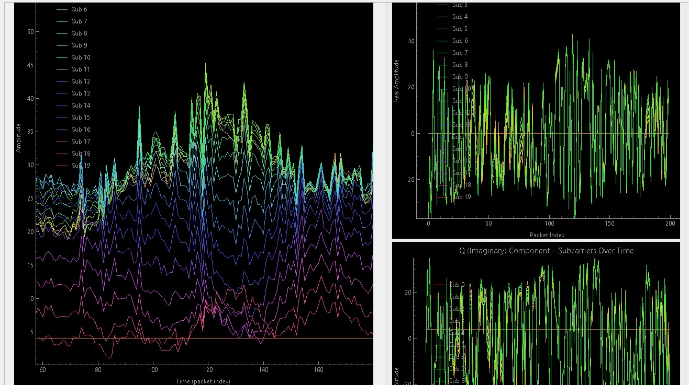
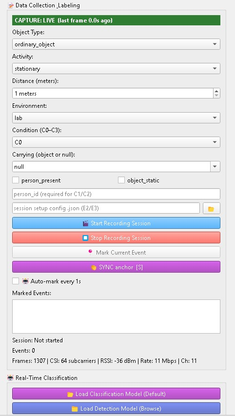
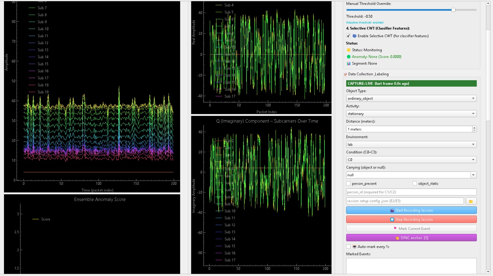
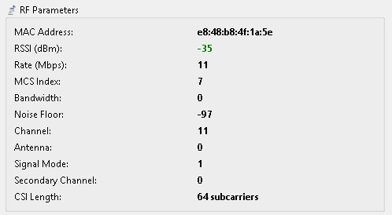

# RF_ESP32_CSI_Tools
Real-time Wi-Fi CSI acquisition, toolkit for ESP32 (2.4 GHz). Official companion software of the RF_ESP32_Dataset. Developed as part of PhD research in RF sensing.

# Unified Wi-Fi CSI Viewer & Spatial Diversity Analyzer

[](https://www.python.org/)
[](https://opensource.org/licenses/Apache-2.0)
[](#)
[](https://github.com/Mohammed-Baqir/RF_ESP32_Dataset)

> **Developed as part of PhD research in RF Sensing, Wi-Fi CSI Analysis, and Environmental Anomaly Detection.**

A comprehensive, real-time Channel State Information (CSI) acquisition, signal processing, and anomaly detection framework for Espressif ESP32 chips. This tool serves as the primary ingestion engine for the **[RF_ESP32_Dataset](https://github.com/Mohammed-Baqir/RF_ESP32_Dataset)** and provides a modular platform for ongoing research in Wi-Fi sensing accuracy.

The dataset acquisition and real-time sensing are calibrated for the following specific RF environment:

| Component            | Specification                                       |
|----------------------|-----------------------------------------------------|
| **Transmitter (TX)** | 1x TP-Link Wi-Fi Router (3 Antennas, 2.4 GHz)       |
| **Receiver (RX)**    | 1x ESP32 (1 Antenna, 1x1 SISO, 2.4 GHz)             |
| **Frequency Band**   | 2.4 GHz Wi-Fi (20 MHz bandwidth, 64 subcarriers)    |
| **Baud Rate**        | 921,600 bps (High-throughput serial streaming)      |
| **Multi-RX Support** | Up to 8 RX nodes simultaneously (spatial diversity) |


---

## 🖥️ GUI Overview

### 1. Subcarrier Response to Human Activity


*Live subcarrier amplitude surge during human activity with the corresponding
I (Real) / Q (Imaginary) component response — demonstrating the motion
sensitivity of the 2.4 GHz CSI link (TX: 3 antennas → RX: 1 antenna).*

### 2. Signal Processing Pipeline


*Empty-room calibration (≥150 frames), Hampel filtering, ensemble anomaly
detection (Isolation Forest + LOF + Elliptic Envelope) with manual threshold
override, and selective CWT feature extraction.*

### 3. Data Collection & Labeling


*Labeled session recording: object type, activity, distance, environment,
1-second auto-marking, and real-time frame/RSSI/status feedback.*

### 4. Live RF Parameters


*Real-time RF telemetry: MAC, RSSI, rate, MCS, bandwidth, noise floor,
channel, antenna, signal mode, and CSI length (64 subcarriers @ 2.4 GHz).*

---

## 🏗️ System Architecture
The software operates as a unified GUI but consists of **three distinct functional pillars**:

### 1. Structured Dataset Acquisition Engine (Stable)
Designed to automate the collection of labeled CSI data for Human Activity Recognition (HAR), Object Detection, and Environmental Profiling.
* **1-Second Auto-Marking:** Features an automated timer that records and timestamps CSI snapshots exactly every 1 second to ensure uniform temporal distribution in the dataset.
* **Categorized Output:** Automatically structures exported data into the repository's standardized hierarchy (`01_human_activity`, `02_metal_object`, `03_environment_with_metal`).
* **Rich Metadata tagging:** Each 1-second snapshot is bundled with `object_type`, `activity`, `distance`, `environment`, and RF parameters (RSSI, Noise Floor, AGC/FFT gains).

### 2. Real-Time Anomaly Detection Pipeline (Ongoing Research)

An advanced, unsupervised ensemble machine learning pipeline designed to detect environmental anomalies via CSI phase/amplitude shifts.

- **Ensemble Models:** Isolation Forest + Local Outlier Factor (LOF) + Elliptic Envelope
- **Signal Conditioning:** Causal Hampel filtering + Butterworth low-pass filtering
- **Adaptive Thresholding:** Rolling percentiles of clean environmental noise
- **CWT Feature Extraction:** Continuous Wavelet Transform for transient event classification
- **Spatial Diversity Engine:** MRC, Phase Difference, Coherence Index, Spatial PCA

> ⚠️ **Research Note:** This module is currently an independent research track. It is actively being optimized to improve Wi-Fi Anomaly Detection accuracy and has not yet been fully adopted/integrated for supervised training against the labeled `RF_ESP32_Dataset`.


### 3. Real-Time GUI & Signal Visualization

- Live Spectrogram / Waterfall displays
- Real-time IQ (Real/Imaginary) domain plotting
- Subcarrier amplitude over time
- Ensemble anomaly score with adaptive threshold
- Alert system (visual + audio + severity levels)
- Live RF Parameter monitoring
- Real-time statistics (FPS, processing time, memory)

---

## 📦 Associated Dataset & ML Configuration

This software is the primary ingestion engine for the **[RF_ESP32_Dataset](https://github.com/Mohammed-Baqir/RF_ESP32_Dataset)**.

| File                    | Description                                                            |
|-------------------------|------------------------------------------------------------------------|
| `metadata.csv`          | Master index of all 192 sessions, anonymized person IDs, and RF shapes |
| `label_mapping.csv`     | Integer mappings for activities, environments, and object types        |
| `evaluation_folds.json` | Pre-calculated "Leave-One-Environment-Out" cross-validation splits     |
| `LICENSE.txt`           | CC BY 4.0 license for the dataset                                      |

---

## ⚙️ Hardware Setup & Firmware (Prerequisites)
This Python application acts as the **Host-Side Analyzer**. Before running this software, you must flash the ESP32 devices with the official Espressif CSI firmware.

1. **Firmware Setup:** 
   Please follow the official Espressif `esp-csi` documentation to build and flash the RX firmware:
   👉 **[Espressif ESP-CSI Official Setup Guide](https://github.com/espressif/esp-csi)**
2  **Serial Connection:** 
   Once flashed, connect the RX ESP32(s) to your PC via USB. Note the COM ports (e.g., `COM3`, `/dev/ttyUSB0`), as you will need them to launch this viewer.

## ⚠️ Known Limitations
- System overload with large models (RTX 3070, 32 GB RAM)
- Anomaly Detection not yet integrated with labeled dataset
- 
## 🚀 Installation & Usage

### Prerequisites
Ensure you have Python 3.8+ installed. It is highly recommended to use a virtual environment.
```bash
python -m venv csi_env
source csi_env/bin/activate  # On Windows: csi_env\Scripts\activate
pip install -r requirements.txt

